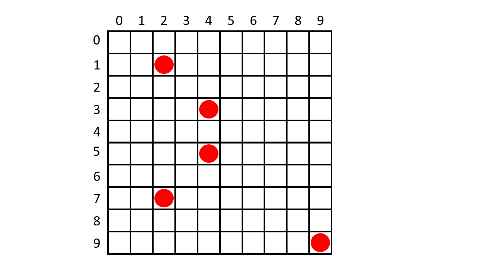

# t2_SistemasOp
t2_SistemasOp

## Descrição do Problema
O objetivo deste trabalho é que o estudante aplique os conceitos de threads, exclusão mútua e coordenação de processos por meio do projeto e implementação de um jogo simples.

O jogo consiste de um tabuleiro 10 X 10 casas (posições). Nesse tabuleiro, inicialmente são distribuídas  cinco fichas aleatoriamente em qualquer uma das 100 casas, conforme a figura abaixo:  

Após disparado o jogo, as fichas movimentam-se simultaneamente para qualquer posição do tabuleiro. O objetivo do jogo é que o jogador elimine todas as fichas dentro de um tempo máximo t. Para eliminar uma ficha, o jogador tem que clicar com o cursor posicionado em qualquer posição da casa na qual a ficha encontra-se. 

O jogo tem cinco níveis de dificuldade: fácil, intermediário e difícil. No fácil, as fichas movem-se mais lentamente e o tempo t é maior; no difícil, as fichas movem-se mais rapidamente e o tempo t é menor; no intermediário o tempo de movimentação e t ficam entre os níveis fácil e difícil.

## Objetivo do trabalho
O objetivo deste trabalho é implementar o jogo em Java ou em C.

## Grupos, Avaliação e Entrega
O trabalho deverá ser realizado em grupos de até 3 estudantes. Os estudantes serão responsáveis por formar os grupos com auxilio da ferramenta Escolha de Grupos - Trabalho 2 (T2) disponível no Moodle. Um dos integrantes de cada grupo deverá submeter, via Moodle, um arquivo contendo o código fonte em C ou Java contendo a solução do trabalho. Mesmo estudantes que realizarem o trabalho sozinhos deverão se enquadrar em algum grupo. A data/hora limite para o envio dos trabalhos é 27/11/2018 às 23:55h.  
Não será permitida a entrega de trabalhos fora desse prazo: trabalhos não enviados no prazo receberão nota zero. Após a data limite para entrega, os alunos deverão agendar a apresentação do trabalho com professor.  
O professor irá avaliar não somente a corretude mas também o desempenho e a clareza da solução. Além disso, os estudantes serão avaliados pela apresentação e entendimento do trabalho.  
A implementação e apresentação valerão 40% e 60% da nota do trabalho, respectivamente.  
Na apresentação, o professor questionará individualmente cada componente do grupo sobre aspectos das estratégias utilizadas e sobres aspectos de código da implementação. Caso a implementação exija que o jogador forneça as coordenadas da jogada em vez de movimentar-se no tabuleiro por meio das setas ou mouse, a nota máxima será 8,0 (oito).

